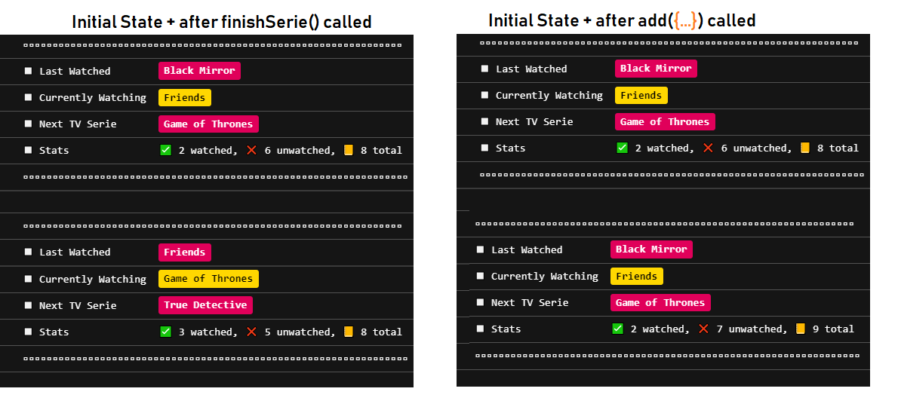
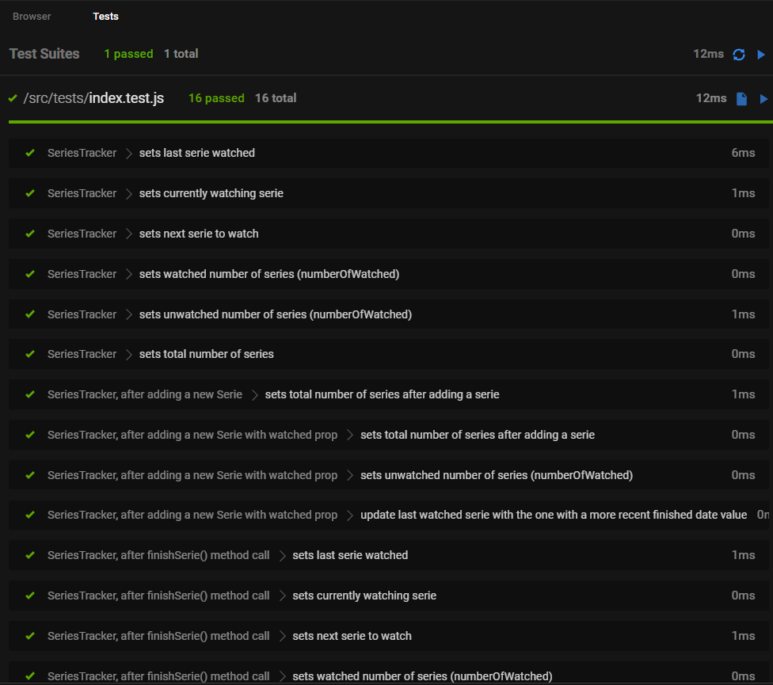

## Task: TV Series Tracker

Codesandbox linki:
https://codesandbox.io/s/magical-silence-vsob4?file=/src/index.js:1784-2411
projeyi codesandbox'dan forklayarak da çalışabilirsiniz.

Bittiğinde index.js'yi kopyalayıp repoya yapıştırmanız yeterli.

index.js dosyası içindeki yorum satırlarına göre SeriesTracker fonksiyonunu çalışır hale getirerek konsolda ekran görüntüsündeki değerlerin çıkmasını sağlayın.

VS COde'da Jest Runner eklentisini yükleyerek ya da Codesandbox'da doğrudan Tests sekmesinden otomatik testleri çalıştırabilirsiniz.

tests/index.test.js dosyasını okuyarak istenenleri daha detaylı görebilirsiniz.

Listenize aldığınız dizilerin izlenmiş ya da o anda izleniyor olma durumlarını saklıyor.

Aynı anda tek dizi izlenebiliyor. mySeriesTracker.finishSerie(); ile mevcut dizi izlenmiş olarak kaydedilip sıradaki dizi izlenmeye başlanıyor.

Konsol Çıktısı:

Codesandbox Başarılı Test Sonuçları Ekran görüntüsü

